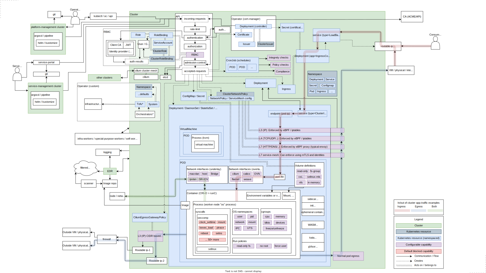

# Kubernetes security diagram (cheatsheet)

## What's this?

This is a digram made to better understand and get an overview of kubernetes security.
It's not complete (but you are welcome to submitt a PR), nor is it perfect, it is biased and it might not be for you.

It might however help you to discuss kubernetes in a security-context with your team, or just to get a better understanding yourself.

The drawing is most likely an overkill. It is not ment as a "solution" or design.
Also, it is on-prem... For non on-prem, it might not be that relevant.

## Where does it come from?

It is made for the purpose stated above inside Telenor Norway. It doesn't reflect any internal designs, architecture or even pattern. The diagram was made for discussion, but ended up being a good cheatsheet in general. So it's released so other companies or people might use it as well.

## Changelog

* v4 (2025-03-10)
  * Putting some items inside groups with additional information
  * Updating some descriptions
  * Better separation of namespaced vs cluster resources. More namespace info added as 31 and 32
  * Clearifications in 5 about where policies can be defined
  * Adding some example traffic flows, ingress and egress. Made traffic flow more intuitive
  * Clearification note on Deployment object. It's the same as the single-object Deployments in the drawing
* v3 (2025-01-10)
  * More typo and visual fixes
  * Adding 29 about kubernetes distroes
  * Adding 30 about service portal
  * Replacing "Crossplane" box with more generic info.
* v2 (2025-01-07)
  * Some clearifications and typo fixes
  * Adding info about network interfaces (28 and 29)
  * Adding focus priorites colors
* v1 (2024-12-17): Released to the public

## How to contribute

* Create issues with fixes, improvements and suggestions.
* Create pull-requests on the drawio file with details about the changes you did.
* To generate a new export using draw-io, use
  * export-as > png
  * border width: 15
  * uncheck all options
* Export as svg as well

## Diagram

